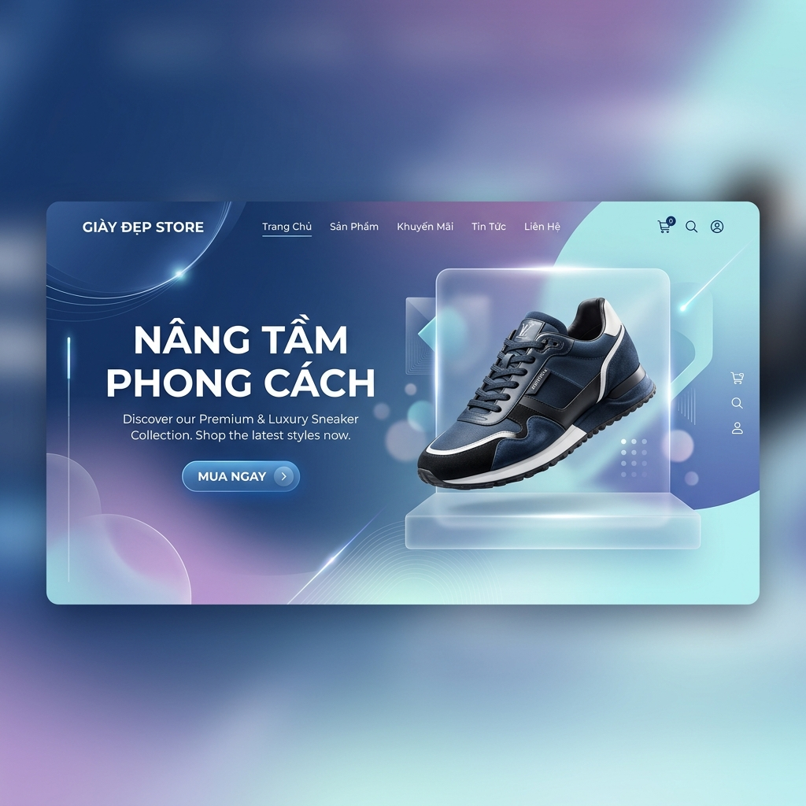
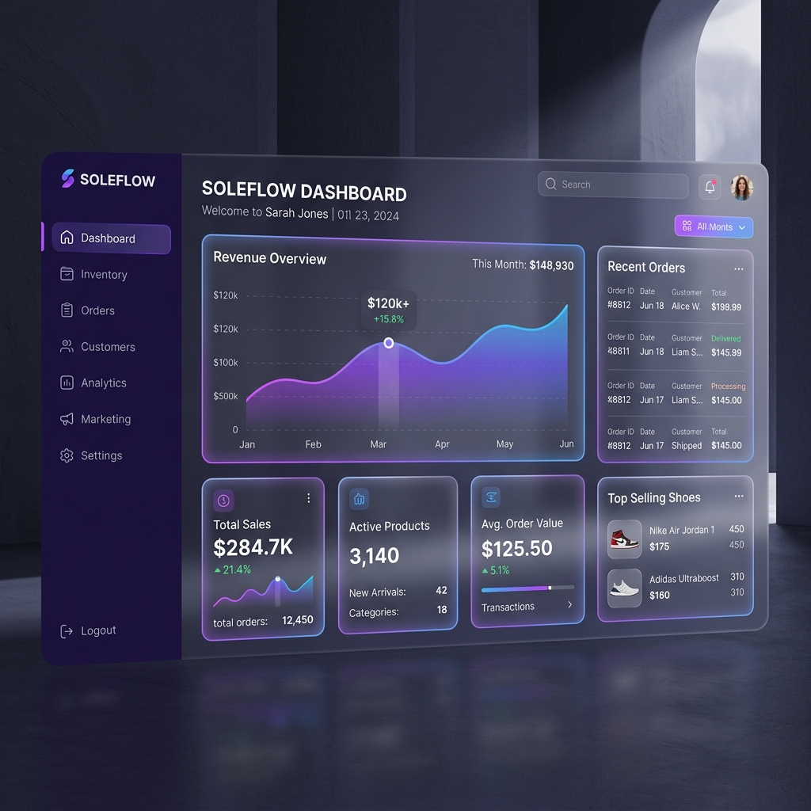
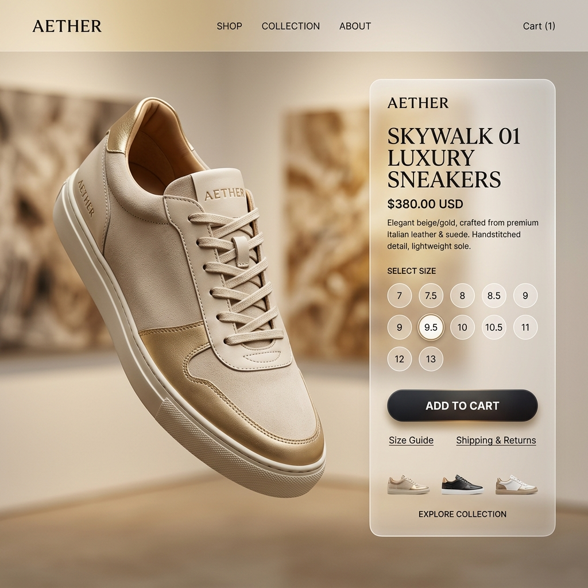

<div align="center">



# 👟 Giày Đẹp Store - Premium Shoe Management System
### *Modern Full-stack Solution for Luxury Footwear Retail*

[](https://fastapi.tiangolo.com/)
[](https://vuejs.org/)
[](https://tailwindcss.com/)
[](https://www.postgresql.org/)

[**🇻🇳 TIẾNG VIỆT**](#-tiếng-việt) | [**🇺🇸 ENGLISH**](#-english)

</div>

---

# 🇻🇳 TIẾNG VIỆT

## 📖 Giới thiệu
**Giày Đẹp Store** không chỉ là một trang web bán hàng đơn thuần, mà là một hệ thống quản lý thương mại điện tử chuyên sâu cho ngành giày dép. Dự án tập trung vào việc cung cấp trải nghiệm người dùng cao cấp thông qua thiết kế **Glassmorphism** và đảm bảo sự ổn định, tốc độ xử lý vượt trội nhờ kiến trúc hiện đại.

## ✨ Chi tiết Tính năng

### 👤 Cho Khách hàng (Client)
- **Hệ thống Tài khoản**: Đăng ký, đăng nhập JWT, quản lý hồ sơ và nhiều địa chỉ giao hàng.
- **Mua sắm thông minh**: Bộ lọc sản phẩm đa năng (theo giá, danh mục, kích thước), tìm kiếm thời gian thực.
- **Giỏ hàng & Thanh toán**: Quy trình thanh toán tinh gọn, áp dụng mã giảm giá tự động, quản lý Wishlist.
- **Tương tác**: Đánh giá sản phẩm sau khi mua, theo dõi trạng thái đơn hàng (Chờ xử lý, Đang giao, Thành công).

### 🛠️ Cho Quản trị viên (Admin)
- **Dashboard Toàn diện**: Biểu đồ thống kê doanh thu, số lượng khách hàng và đơn hàng mới.
- **Quản lý Kho**: Thêm/sửa sản phẩm, quản lý số lượng tồn kho theo size, xử lý hình ảnh Base64.
- **Vận hành**: Cập nhật trạng thái đơn hàng, quản lý người dùng, tạo chương trình khuyến mãi (Coupons).
- **Báo cáo**: Xuất dữ liệu đơn hàng và sản phẩm ra file Excel chuyên nghiệp.

## 📐 Kiến trúc & Bảo mật
1. **Kiến trúc Tách biệt (Decoupled)**: Frontend và Backend hoạt động độc lập qua RESTful API, giúp dễ dàng mở rộng và bảo trì.
2. **Lớp Dịch vụ (Service Layer)**: Mọi logic nghiệp vụ được xử lý tập trung tại Backend, đảm bảo tính nhất quán của dữ liệu.
3. **Bảo mật tối đa**:
    - Mã hóa mật khẩu 2 lớp bằng Bcrypt.
    - Xác thực bằng Access Token & Refresh Token (JWT).
    - Phân quyền nghiêm ngặt giữa Admin và Client.

## 🛠️ Công nghệ sử dụng
| Thành phần | Công nghệ |
| :--- | :--- |
| **Giao diện** | Vue 3 (Composition API), Vite, Pinia, Tailwind CSS v4, AOS |
| **Xử lý** | FastAPI (Python), Pydantic v2, SQLAlchemy |
| **Cơ sở dữ liệu** | PostgreSQL, Alembic (Migrations) |
| **Tiện ích** | Chart.js (Biểu đồ), XLSX (Xuất Excel), Axios (HTTP Client) |

## 🚀 Hướng dẫn khởi chạy
### ⚙️ Backend (Python)
```bash
cd backend
python -m venv venv
# Windows: venv\Scripts\activate
pip install -r requirements.txt
python -m uvicorn app.main:app --reload
```
### 🎨 Frontend (Vue.js)
```bash
cd frontend
npm install
npm run dev
```
> [!NOTE]
> **Quản trị viên mặc định:** `admin@qlbg.com` / `admin123`

## 📸 Hình ảnh giao diện
<div align="center">
  <p><em>Thống kê doanh thu (Dashboard)</em></p>
  
  <br><br>
  <p><em>Trải nghiệm sản phẩm</em></p>
  
</div>

## 📂 Cấu trúc dự án
-   `backend/`: Logic xử lý API, Models, Schemas và Migrations.
-   `frontend/`: Giao diện người dùng, Components, Stores (Pinia).
-   `md/`: Tài liệu dự án (Tính năng, Công nghệ, Checklist).
-   `data/`: Database seeding và file mẫu.
-   `doc/`: Hình ảnh và tài liệu hướng dẫn sử dụng.

---

# 🇺🇸 ENGLISH

## 📖 Introduction
**Giày Đẹp Store** is more than just an online shop; it is a specialized e-commerce management system for the footwear industry. The project focuses on delivering a premium user experience through **Glassmorphism** design while ensuring stability and superior performance thanks to its modern architecture.

## ✨ Feature Details

### 👤 For Customers (Client)
- **Account System**: Registration, JWT login, profile management, and multiple shipping addresses.
- **Smart Shopping**: Versatile product filters (price, category, size), real-time search.
- **Cart & Checkout**: Streamlined checkout process, automated coupon application, Wishlist management.
- **Interaction**: Product reviews, order status tracking (Pending, Shipping, Completed).

### 🛠️ For Administrators (Admin)
- **Comprehensive Dashboard**: Visual analytics for revenue, customer count, and new orders.
- **Inventory Management**: CRUD products, stock management by size, Base64 image handling.
- **Operations**: Order status updates, user management, and promotional campaign (Coupons) creation.
- **Reporting**: Professional Excel exports for orders and product data.

## 📐 Architecture & Security
1. **Decoupled Architecture**: Frontend and Backend operate independently via RESTful API for scalability and easy maintenance.
2. **Service Layer**: Business logic is centralized in the Backend, ensuring data consistency across all platforms.
3. **Maximum Security**:
    - Dual-layer password encryption using Bcrypt.
    - Authentication via Access & Refresh Tokens (JWT).
    - Strict role-based access control (RBAC) between Admin and Client.

## 🛠️ Technology Stack
| Component | Technology |
| :--- | :--- |
| **Frontend** | Vue 3 (Composition API), Vite, Pinia, Tailwind CSS v4, AOS |
| **Backend** | FastAPI (Python), Pydantic v2, SQLAlchemy |
| **Database** | PostgreSQL, Alembic (Migrations) |
| **Utilities** | Chart.js (Analytics), XLSX (Excel Export), Axios (HTTP Client) |

## 🚀 Quick Start
### ⚙️ Backend (Python)
```bash
cd backend
python -m venv venv
# Windows: venv\Scripts\activate
pip install -r requirements.txt
python -m uvicorn app.main:app --reload
```
### 🎨 Frontend (Vue.js)
```bash
cd frontend
npm install
npm run dev
```
> [!NOTE]
> **Default Admin:** `admin@qlbg.com` / `admin123`

## 📸 Screenshots
<div align="center">
  <p><em>Dashboard Analytics</em></p>
  
  <br><br>
  <p><em>Product Experience</em></p>
  
</div>

## 📂 Project Structure
-   `backend/`: API logic, Models, Schemas, and Migrations.
-   `frontend/`: UI source, Components, and Pinia Stores.
-   `md/`: Detailed functional and technical documentation.
-   `data/`: Database seeding and sample files.
-   `doc/`: Media assets and user manuals.

---

<div align="center">
  <p>Developed with ❤️ for the Footwear Industry / Phát triển với ❤️ dành cho ngành Giày dép</p>
</div>
